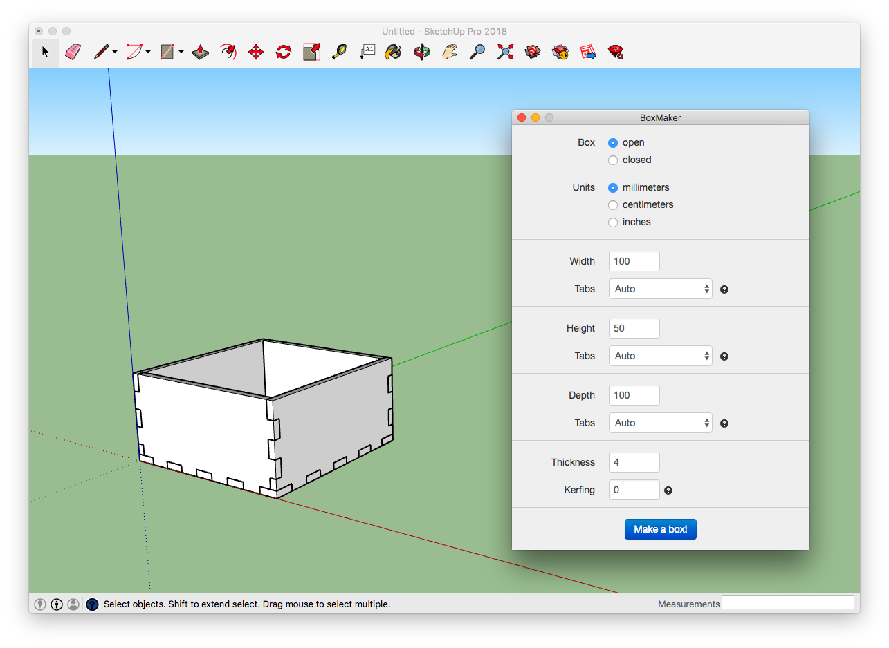
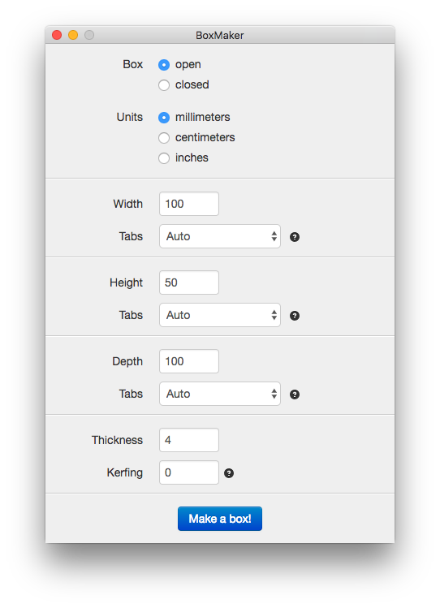

This is a plugin for Sketchup which creates a 3d model of a box that can be laser cut.

Installing the plugin:

-   [Download the plugin](https://github.com/subhero24/box-maker/raw/master/build/box-maker.rbz)
-   Open Sketchup
-   Choose window > extension manager > install extension and find the .rbz file
-   After installing there is a new 'Box' menuitem in the 'Draw' menu

Configure the box that you want and click the "Make a box!" button and your sketchup model will be created.

If you need to export the faces for lasercutting, there is a [plugin for exporting faces to SVG](https://github.com/JoakimSoderberg/sketchup-svg-outline-plugin).

Have fun boxing!
